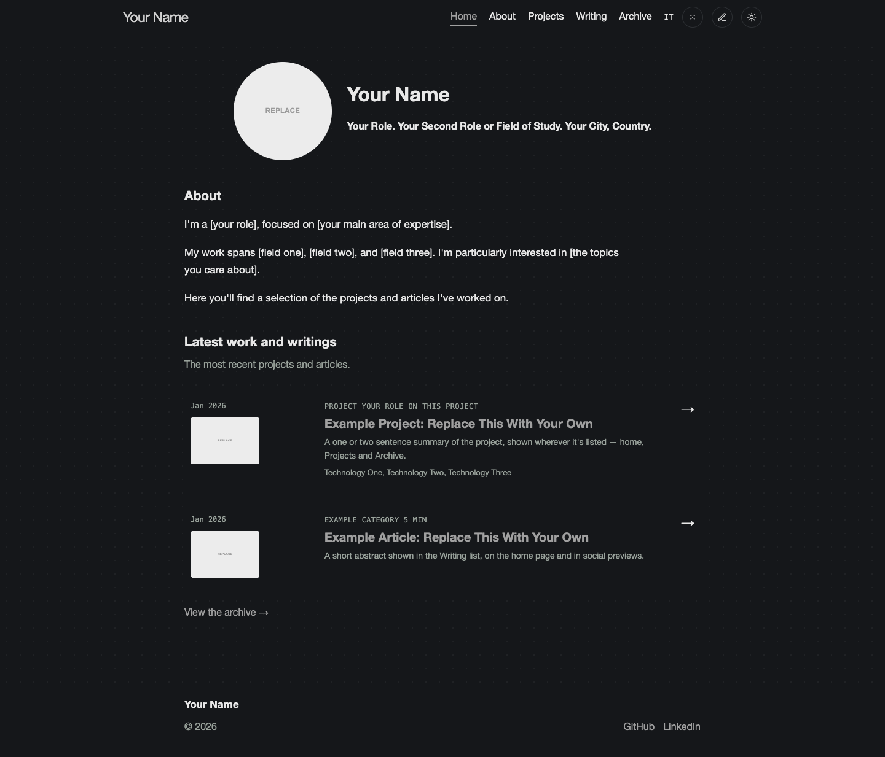
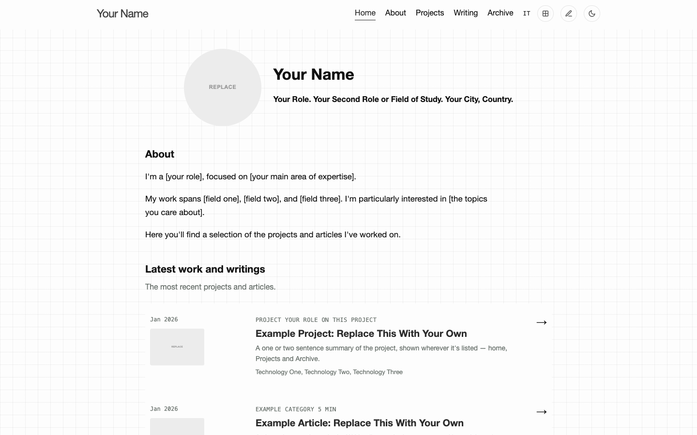
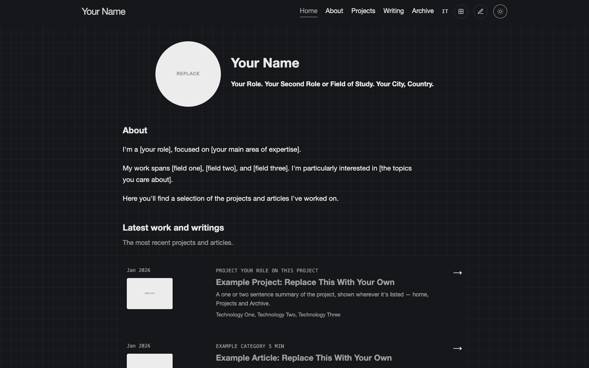
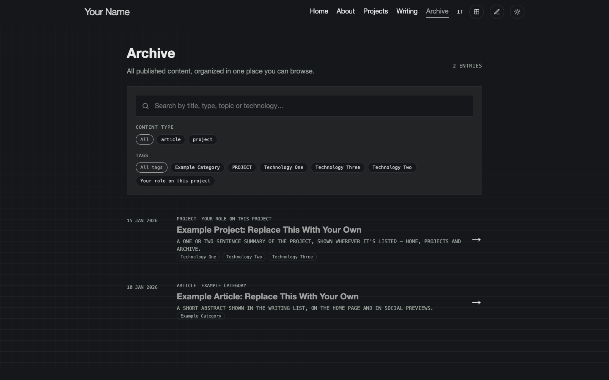

<div align="center">

# Developer Portfolio Template

**A clean, multilingual Jekyll template for developers and researchers to present projects, case studies, and technical writing.**

[](https://jekyllrb.com/)
[](https://pages.github.com/)
[](LICENSE)
[](docs/guide.md#translations-and-adding-a-language)

**[Live demo →](https://andrei-stefan20.github.io/developer-portfolio-template/)**

<br>



</div>

## Overview

This is a ready-to-fork Jekyll template for a personal portfolio: **projects, case studies, and technical articles**, in a clean interface that stays readable on desktop and mobile.

It's intentionally lightweight: Jekyll generates the pages, GitHub Actions builds the search index, and GitHub Pages publishes the result. No frontend framework, no build step beyond Jekyll itself.

### What makes it different

- **Projects and articles share one content system** while keeping their own layouts.
- **Built-in multilingual support** (English + Italian out of the box): pages are linked through shared slugs, and adding any further language is a documented, mechanical process — see [Translations and adding a language](docs/guide.md#translations-and-adding-a-language).
- **Archive search and filters** make projects, articles, topics, and technologies easy to browse.
- **Automatic light/dark mode** follows the visitor's browser on first visit and remembers manual choices.
- **Configurable visual style**: grid, dots, or plain background, plus an optional handwritten font, all from one config file.
- **No personal data baked in**: every piece of identity, content, and imagery in this repository is a placeholder meant to be replaced.

## Getting started

1. Click **Use this template** on GitHub (or clone this repository).
2. Rename the repository to `yourname.github.io` for a user site, or keep any name for a project site.
3. Edit `_config.yml`: your name, role, links, and the languages you want to keep.
4. Replace the placeholder images in `images/` (see [`images/profile.svg`](images/profile.svg) and the `example-project`/`example-article` covers).
5. Replace the two example entries in `entries/` with your own projects and articles, or delete them once you're done using them as a reference.
6. Run `ruby scripts/validate_site.rb` and `bundle exec jekyll build`, then push to `main`: GitHub Actions takes care of the rest.

For the full walkthrough, with screenshots for every step, see **[the template guide](docs/guide.md)**. For the philosophy and safe-update workflow, see **[`docs/TEMPLATE_GUIDE.md`](docs/TEMPLATE_GUIDE.md)**.

## Interface

<table>
<tr>
<td width="50%">

</td>
<td width="50%">

</td>
</tr>
<tr>
<td align="center"><strong>Light mode</strong></td>
<td align="center"><strong>Dark mode</strong></td>
</tr>
</table>



The archive combines all published content in one place and supports filtering by content type, category, tag, and technology.

## Technology stack

| Layer | Technology |
|---|---|
| Static site | Jekyll, Liquid, Markdown |
| Styling | Custom CSS, responsive grid layouts |
| Interactions | Vanilla JavaScript |
| Search | Pagefind |
| Deployment | GitHub Actions and GitHub Pages |
| Comments | Optional Giscus integration |
| Analytics | Optional Plausible integration |
| Localisation | YAML locale files and language-aware content |

## Content structure

```text
entries/
├── projects/
│   └── project-slug/
│       ├── en.md
│       └── it.md
└── articles/
    └── article-slug/
        ├── en.md
        └── it.md

images/
├── projects/
└── articles/
```

Each project or article has its own folder. Translations stay together and share the same `slug`, so the language switcher can find the matching page automatically. Give each non-default language its own permalink (e.g. `/it/entries/<slug>/`): reusing the English one makes Jekyll silently overwrite one language's page with the other at build time. The repository ships with one `example-project` and one `example-article`; duplicate or replace them to add your own.

## Appearance configuration

Most visual options are controlled from `_config.yml`:

```yaml
appearance:
  accent_color: "#2b2b2b"
  recent_items_on_home: 5
  background_pattern: "grid"   # none, grid, dots
  theme_mode: "auto"           # auto, light, dark
  font_style: "default"        # default, hand
```

Visitors can also change background, font, and theme themselves from the three buttons in the header. See the [template guide](docs/guide.md#the-three-buttons-in-the-top-right) if you'd rather hide one or more of them.

## Local development

```bash
bundle install
bundle exec jekyll serve
```

Open `http://localhost:4000`.

To test the production search index locally:

```bash
bundle exec jekyll build
npx pagefind --site _site
cd _site && python3 -m http.server 4000
```

## Deployment

Every push to `main` triggers the GitHub Actions workflow:

```text
Jekyll build
   ↓
Pagefind index
   ↓
GitHub Pages artifact
   ↓
Deployment
```

Enable GitHub Pages for the repository (Settings → Pages → Source: GitHub Actions) and every push to `main` publishes automatically.

## Main repository areas

| Purpose | Path |
|---|---|
| Site configuration | `_config.yml` |
| Localised text | `_data/locales/` |
| Projects | `entries/projects/` |
| Articles | `entries/articles/` |
| Reusable components | `_includes/` |
| Page layouts | `_layouts/` |
| Styling | `css/` |
| Client-side behaviour | `js/` |
| Full walkthrough guide | `docs/guide.md` |
| Template philosophy & update workflow | `docs/TEMPLATE_GUIDE.md` |
| GitHub Pages workflow | `.github/workflows/pages.yml` |

## License

MIT. See [`LICENSE`](LICENSE): the copyright name is a placeholder, and `scripts/sync_repository.rb` regenerates it from `_config.yml` whenever you change `author.name`.
